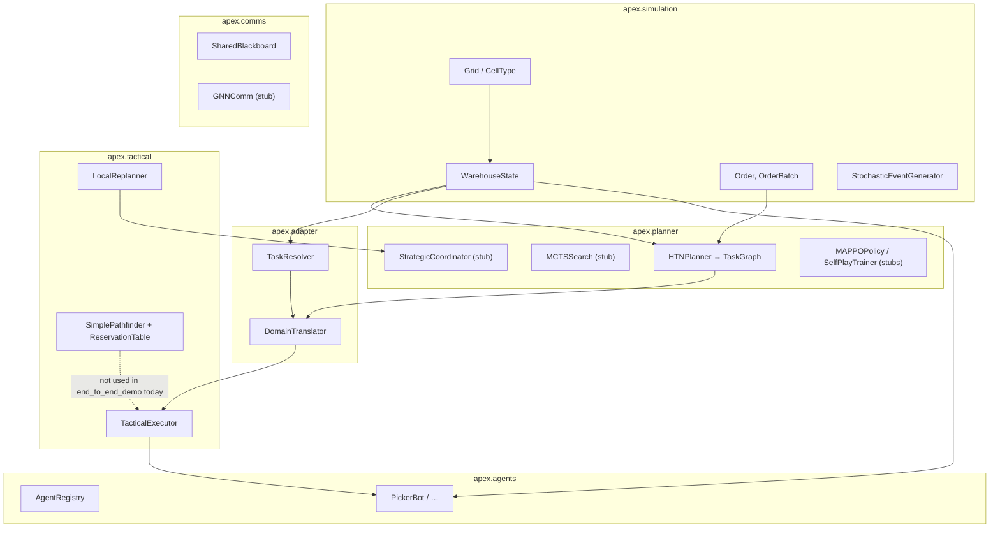

# APEX code map

This is a map of the repository: what the system is, how major pieces relate, and why those boundaries exist. For product vision and research framing, see [Project_Description.md](Project_Description.md) and the root [README.md](../README.md). For a milestone-style module plan, see [Implementation_Plan.md](Implementation_Plan.md).

---

## Overview

APEX (Adaptive Planning EXecution) is a Python research and education codebase for **hierarchical multi-agent planning** in a **grid-based warehouse** simulated with **SimPy** (discrete-event time). The “why” of the split across layers is to **separate** long-horizon *what to do* (strategic task graphs) from *where things are* in the world (domain binding) and from *how to move and react locally* (tactical instructions, path constraints, local disruption handling)—so teams can grow each concern independently and test it in isolation. The repository delivers working simulation types, a concrete **HTN-style** order-to-task decomposer, a **domain adapter** that turns abstract tasks into `TaskInstruction` records, a **tactical executor** and **local replanner** with defined escalation types, and optional **pygame** visualization. Several advanced pieces from the project narrative exist mainly as **interfaces and stubs** (MCTS search loop, strategic coordinator orchestration, MAPPO, GNN comms, full experiment runner); the map below says where those hooks live and what is actually implemented today.

---

## Glossary

| Term | Definition |
| --- | --- |
| **Agent** | A SimPy-driven entity (`apex.agents`) with a type (e.g. picker, carrier, sorter), pose on the grid, battery/payload, and a `run` loop. |
| **Strategic planning** | Building a `TaskGraph` of tasks and dependencies from orders (main entry: `HTNPlanner.plan_batch`); does not, by itself, assign motion on the grid. |
| **Tactical** | Short-horizon concerns: per-agent `TaskInstruction` queues, optional space-time path reservation, and local recovery from disruptions (`apex.tactical`). |
| **Adapter (domain adapter)** | The bridge from planner-oriented abstractions to simulation-grounded resources: `TaskResolver` (IDs, shelves, bays, conveyors) and `DomainTranslator` (task → `TaskInstruction`). |
| **Task graph** | `TaskGraph`: nodes are `TaskNode` records (task type, order id, deadlines, dependencies) plus explicit edges. Produced by the HTN planner, consumed by higher-level wiring (and demos). |
| **Task instruction** | `TaskInstruction`: one executable directive for an agent (`action_type`, `target_pos`, `shelf_id`, …) understood by the tactical executor and demo drivers. |
| **Warehouse state** | `WarehouseState`: single composed snapshot of `Grid`, shelf zones, conveyors, bays, and order lists—passed to planners, translators, and agents. |
| **Pos** | Position as `(row, col)`; see project conventions in the root README. |
| **HTN (Hierarchical Task Network)** | Here: hand-authored decomposition rules (`HTNMethod` / `BUILT_IN_METHODS`) applied recursively by `HTNPlanner`—not a bundled third-party HTN engine. |
| **Reservation table** | Space–time set of claimed `(position, time)` cells used so paths can avoid each other; paired with the grid pathfinder in `apex.tactical.pathfinder`. |
| **Escalation** | `EscalationSignal` from `LocalReplanner` when a disruption cannot be patched locally, intended for `StrategicCoordinator.replan` (stub). |
| **Blackboard** | `SharedBlackboard` for published `AgentIntention` objects—optional coordination without tight coupling to the executor. |

---

## Architecture at a glance

Data and control generally flow **from orders and layout** through **strategic decomposition**, then **domain translation**, into **tactical queues** and **SimPy processes** (agents). The diagram is directional (some modules are not yet wired in the main demo—see [Out of scope / known limits](#out-of-scope--known-limits)).

*Legend:* solid arrows = implemented paths in the primary demo or clear library calls; dotted = module exists and is testable, but the stock `examples/end_to_end_demo.py` does not import the pathfinder (the demo uses instruction-driven movement and optional waypoint polylines for the viewer).

---

## Component deep dives

### `apex.simulation` — world model and time

**What it is** The **shared substrate** for everything else: floor grid, static layout objects, orders, and optional stochastic event streams.

**What it does** `Grid` holds `CellType` per cell and walkability. `WarehouseState` bundles the grid, `ShelfZone`, `ConveyorSegment`, `LoadingBay`, and pending/active `Order` lists. `StochasticEventGenerator` is a SimPy process that can inject configured randomness (see module docstring). `order.py` defines `Order`, `OrderItem`, and batch types.

**Why it exists** Without a **single** `WarehouseState` and `Grid`, planners and agents would duplicate layout rules; changes to “what is a shelf” would be scattered. This package is the **integration anchor** named explicitly in the root README.

**Key interactions** Constructed at startup; passed into `HTNPlanner`, `DomainTranslator`, `TaskResolver`, `Agent.run`, and visualization. `Grid` is referenced by `SimplePathfinder`.

---

### `apex.agents` — heterogeneous SimPy processes

**What it is** The **actor layer**: concrete bot classes and a small `AgentRegistry` for looking up the fleet.

**What it does** `Agent` (ABC) owns the main SimPy `run` loop, movement helpers, and battery; `PickerBot`, `CarrierBot`, and `SorterBot` specialize behavior. `AgentCapabilities` and `AgentStatus` are shared Pydantic/enum types.

**Why it exists** To keep **kinematics and work simulation** separate from “planning” code: the same `TaskInstruction` can drive different agent types, and new agent types can be added without changing `HTNPlanner`.

**Key interactions** Receives work indirectly via demos that pull from `TacticalExecutor`; `StrategicCoordinator` is typed against `AgentRegistry` for future assignment logic. Not every demo uses every agent class.

---

### `apex.tactical` — instructions, pathfinding, local repair

**What it is** The **tactical** layer: queues of `TaskInstruction`, optional **multi-agent–style** routing with a **reservation table**, and `LocalReplanner` for structured disruptions.

**What it does** `TacticalExecutor` queues per-agent instructions and exposes labels for telemetry. `ReservationTable` records space–time claims. `SimplePathfinder` runs **A\*** on the `Grid` while respecting existing reservations. `LocalReplanner.handle` returns either a small `Resolution` (e.g. detour `TaskInstruction`) or `EscalationSignal`.

**Why it exists** So **low-level** failures (blocked path, bad pick) can be **classified and handled** without always rerunning full strategic planning. Separating the executor from `HTNPlanner` matches the intended research architecture (tactical repair vs. strategic replan).

**Key interactions** `DomainTranslator` produces `TaskInstruction` objects. Demos may run executor-driven processes by hand. `StrategicCoordinator.replan` is the intended consumer of `EscalationSignal` (not yet implemented). Pathfinding is used from tests and `__main__` blocks; the bundled end-to-end example does not currently call `SimplePathfinder` (see diagram note).

**Algorithms (see [Algorithms / non-obvious mechanics](#algorithms--non-obvious-mechanics))** A* + reservation checks; module header names CBS-style *conflict handling*; the code does not implement a full **Conflict-Based Search** tree search as a separate routine.

---

### `apex.adapter` — grounding abstract tasks

**What it is** The **domain bridge** from planner-facing tasks to executable instructions.

**What it does** `TaskResolver` maps SKUs and routing hints to `ShelfZone`, `LoadingBay`, and `ConveyorSegment` instances (with **MVP** heuristics where noted in docstrings—e.g. “first bay”, ordered conveyor list). `DomainTranslator` turns `AbstractTask` into a **sequence** of `TaskInstruction` for pick / transport / dispatch-style flows.

**Why it exists** Strategic tasks refer to *intent* (pick, stage, dispatch); the simulation needs *IDs and coordinates*. Centralizing resolution avoids hardcoding layout into the HTN layer and documents **MVP** vs. **production** policy.

**Key interactions** Called after `HTNPlanner` (or by hand in demos) with live `WarehouseState`. Downstream: `TacticalExecutor.assign`.

---

### `apex.planner` — task graphs, MCTS, MARL (mixed maturity)

**What it is** The **strategic** side: `HTNPlanner` and `TaskGraph` are real; `MCTSSearch`, `StrategicCoordinator`, and MARL types are **scaffolding**.

**What it does** `HTNPlanner.decompose` matches `BUILT_IN_METHODS` in `htn/methods.py` to expand `fulfill_order` into chains of `TaskType` steps; `plan_batch` unions nodes and edges for each order. `MCTSSearch.search` and `StrategicCoordinator.plan` / `replan` are `NotImplementedError`. `MAPPOPolicy` and `SelfPlayTrainer` are placeholder APIs.

**Why it exists** The **data structures** (`TaskNode`, `TaskGraph`, `PlanningMode`) stabilize APIs before algorithms are complete. The HTN piece proves the **pipeline** from `OrderBatch` to a graph; MCTS/MARL are hooks for the roadmap in `Project_Description.md`.

**Key interactions** `OrderBatch` + `WarehouseState` in; `TaskGraph` out. `EscalationSignal` is the intended input to `replan`. MARL and GNN are not wired to training in-tree.

---

### `apex.comms` — shared intentions and future GNN

**What it is** Lightweight **coordination** (`SharedBlackboard`) plus a `GNNComm` stub for learned messaging.

**What it does** `AgentIntention` records coarse plans; the blackboard supports post/read/clear. `GNNComm` raises `NotImplementedError` on `encode` / `message_pass`.

**Why it exists** To experiment with **decentralized** information sharing without entangling it with the executor’s queues; optional `torch` / PyG are isolated in `pyproject.toml` as extras.

**Key interactions** None required for the core HTN → translator → executor path; can be used by new agent logic or visualization.

---

### `apex.evaluation` — metrics and experiment harness

**What it is** `MetricsCollector` / `EpisodeMetrics` types and an `ExperimentRunner` shell.

**What it does** `ExperimentRunner.run_episode` and `run_sweep` are stubs; the module is the planned home for **repeatable** scenario studies once the stack is fully wired.

**Why it exists** Separates **paper-style evaluation** from the simulator so configs (`ScenarioConfig`) can grow without forking the warehouse model.

---

### `apex.common` — small shared utilities

**What it is** Cross-package helpers (e.g. `manhattan_distance` in `geometry.py`) to avoid duplicating math.

**Why it exists** Keeps `adapter`, `tactical`, and `agents` aligned on the same **metric** definitions.

---

### `apex.visualization`, `examples/`, `scripts/`, `viz/`, `config/`, `experiments/`

**What it is** **Entry points and configuration** around the library. `WarehouseVisualizer` (under `apex/visualization/`) provides pygame rendering when `pygame-ce` is installed. `examples/end_to_end_demo.py` is the **canonical** “plan → translate → execute → (optional) visualize” script. `scripts/` holds CLI-style stubs (`run_scenario.py`, `train_marl.py`). Root `config/*.yaml` and `experiments/*.yaml` support scenario and experiment naming even when not every key is read by a single driver yet. The top-level `viz/` package (renderer/dashboard) is separate from `apex.visualization`—check imports before extending.

**Why** Demos and YAML keep the **library** importable from tests and notebooks without a mandatory UI or training stack.

---

## Algorithms / non-obvious mechanics

| Topic | What the code does | Reference |
| --- | --- | --- |
| **A* on a grid** | `SimplePathfinder.find_path` uses a binary heap, expands neighbors on the static grid, and treats **time** as one step per move for reservation checks. | Russell & Norvig, *Artificial Intelligence: A Modern Approach* (A* and heuristics); [SimPy](https://simpy.readthedocs.io/) for the simulation clock used elsewhere. |
| **Heuristic** | **Manhattan distance** to the goal (admissible on a 4-connected grid with unit cost). | Standard admissible heuristic for grid MAPF with Manhattan moves. |
| **Reservation table** | Agents (or tests) pre-register `(position, time)`; A* **skips** moves that would enter a reserved slot. This implements **deconfliction by forbidden space–time** rather than a full multi-agent **CBS** constraint tree. | Multi-agent pathfinding background: Shomon & Felner, “Conflict-based search for optimal multi-agent pathfinding” *Artificial Intelligence* (2015) explains **full** CBS; this repo’s **mechanism** is closer to a **fixed reservation** + single-agent replan (variant / simplified). |
| **MCTS (planned)** | `MCTSSearch` documents UCT-style selection and backprop; methods are not implemented. | Kocsis & Szepesvári, “Bandit based Monte-Carlo planning” (2006) for **UCT**; [official draft PDF](https://ccg.szu.edu.cn/papers/Teaching/Material/BanditBasedMonte-CarloPlanning.pdf) is widely cited. |
| **HTN** | **Project-specific** methods in `BUILT_IN_METHODS`; the planner does not call an external HTN library. | HTN planning survey: Nau, *HTN planning* / Ghallab et al., *Automated Planning*; treat this codebase as a **toy** HTN for the simulation. |
| **MAPPO** | Interface only. | “The Surprising Effectiveness of MAPPO in Cooperative Multi-Agent Games” (Yu et al., 2021) for algorithm context. |

---

## Typical execution flows

### Flow 1 — End-to-end demo (`examples/end_to_end_demo.py`)

1. Build `Grid`, `WarehouseState`, and `OrderBatch` with `Order` / `OrderItem` lines referencing shelf zone IDs.
2. `HTNPlanner().plan_batch(...)` → `TaskGraph` (printed for inspection; demo then uses hand-built `AbstractTask` list to mirror a slice of work).
3. `DomainTranslator().translate(...)` per `AbstractTask` → list of `TaskInstruction`.
4. `TacticalExecutor(env).assign(...)` enqueues work; a custom SimPy process `_drive_executor_queue` pops instructions and calls `PickerBot` movement or work steps.
5. If pygame is available, `WarehouseVisualizer` renders agents and **optional** waypoints; SimPy time advances in small `env.run` slices.

*This path exercises **HTN** + **adapter** + **executor** + **agents**; it does not call `SimplePathfinder`.*

### Flow 2 — Unit tests and module `__main__` blocks

- `python -m apex.tactical.pathfinder` / pytest tactical tests: **reservation** + A* on synthetic grids.
- `python -m apex.planner.htn.planner`: builds a **TaskGraph** from a toy batch.
- `python -m apex.adapter.resolver` / translator: **resolution** and translation smoke tests.

### Flow 3 — Intended escalation (partially implemented)

1. A runtime `Disruption` is passed to `LocalReplanner.handle`.
2. If local patch succeeds → revised `TaskInstruction` list; if not → `EscalationSignal`.
3. *Planned:* `StrategicCoordinator.replan(escalation)` → `TaskGraphDelta` (currently not implemented).

---

## Where to change what

| If you need to … | Start in … |
| --- | --- |
| Change floor geometry, walkability, or add cell semantics | `apex/simulation/grid.py`, then `WarehouseState` construction sites |
| Add or adjust order/line item fields | `apex/simulation/order.py` and any `OrderItem` users in `TaskResolver` |
| Change how orders become tasks (task types, order of steps) | `apex/planner/htn/methods.py`, `operators.py`, and `htn/planner.py` |
| Change SKU → shelf / bay / conveyor policy | `apex/adapter/resolver.py` (document MVP assumptions there) |
| Add a new `action_type` for agents | `DomainTranslator.translate` and the agent/executor side that interprets it (e.g. demo driver) |
| Adjust tactical queues or instruction schema | `apex/tactical/executor.py` |
| Tighten multi-agent routing or swap algorithms | `apex/tactical/pathfinder.py` (and then wire it into whichever driver should call it) |
| Define strategic replanning or MCTS/MARL | `apex/planner/coordinator.py`, `mcts/search.py`, `marl/` (expect stubs until implemented) |
| Add live metrics or experiment batches | `apex/evaluation/metrics.py`, then flesh out `ExperimentRunner` |
| Optional pygame UI | `apex/visualization/viewer.py` and optional group `pip install -e ".[viz]"` |

---

## Out of scope / known limits

- **StrategicCoordinator**, **MCTSSearch.search**, **ExperimentRunner** episode driver, **GNNComm**, and **MAPPO** training are **stubs** (`NotImplementedError` on core methods where applicable). Narrative in `Project_Description.md` describes a **target**; this guide reflects the **code as checked in**.
- **`apex.tactical.pathfinder` module** docstring says “CBS”; the implementation is **A* + `ReservationTable`**, not a full **CBS** high/low search loop—see [Algorithms](#algorithms--non-obvious-mechanics).
- **HTN methods** in code use two entries with the same `task="fulfill_order"`; the planner’s `decompose` **returns on the first matching method**, so the second method is **unreachable** until selection logic is added (appears to be a TODO / design follow-up; verify if you extend planning).
- **`config/`** and **`experiments/`** files exist; not every key may be read by a single top-level script—**confirm** the driver you use before assuming a parameter is live.
- **Tests** in `tests/` are a **subset** of what the Implementation Plan once listed; run `pytest` for current behavior.

---

## References

1. S. Russell, P. Norvig, *Artificial Intelligence: A Modern Approach* (A* search, heuristics).  
2. D. Shomon, A. Felner, R. Sturtevant, C. Surynek, *Conflict-based search for optimal multi-agent pathfinding*, Artificial Intelligence, 2015. [DOI: 10.1016/j.artint.2014.11.006](https://doi.org/10.1016/j.artint.2014.11.006) (full **CBS**; contrast with this repo’s reservation + A*).  
3. L. Kocsis, C. Szepesvári, *Bandit based Monte-Carlo planning*, ECML 2006 (**UCT** for MCTS).  
4. C. Yu et al., *The Surprising Effectiveness of MAPPO in Cooperative Multi-Agent Games*, NeurIPS 2021.  
5. [SimPy documentation](https://simpy.readthedocs.io/) — discrete-event processes used across agents and events.  
6. Pydantic v2: [Pydantic documentation](https://docs.pydantic.dev/) (data models in simulation, planning, and tactical modules).

---