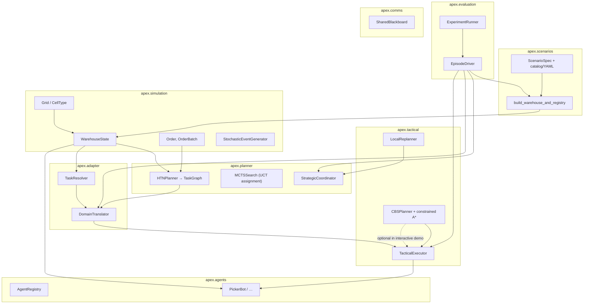

# APEX code map

This is a map of the repository: what the system is, how major pieces relate, and why those boundaries exist. For product vision and research framing, see [Project_Description.md](Project_Description.md) and the root [README.md](../README.md). For a milestone-style module plan, see [Implementation_Plan.md](Implementation_Plan.md).

---

## Overview

APEX (Adaptive Planning EXecution) is a Python research and education codebase for **hierarchical multi-agent planning** in a **grid-based warehouse** simulated with **SimPy** (discrete-event time). The “why” of the split across layers is to **separate** long-horizon *what to do* (strategic task graphs) from *where things are* in the world (domain binding) and from *how to move and react locally* (tactical instructions, path constraints, local disruption handling)—so teams can grow each concern independently and test it in isolation. The repository delivers working simulation types, a concrete **HTN-style** order-to-task decomposer, **UCT MCTS** for optional task-to-agent assignment refinement (`PlanningMode.MCTS_AUGMENTED`), a **domain adapter** that turns abstract tasks into `TaskInstruction` records, a **tactical executor** and **local replanner** with defined escalation types, **`ScenarioSpec` + `EpisodeDriver`** for repeatable evaluation episodes, and optional **pygame** visualization with **MP4** export. The map below says where those pieces live; `StrategicCoordinator.replan` integrates optional MAP/Gemini or HTN-style fallbacks as described in [MAP_Gemini_Rollout.md](MAP_Gemini_Rollout.md).

---

## Glossary

| Term | Definition |
| --- | --- |
| **Agent** | A SimPy-driven entity (`apex.agents`) with a type (e.g. picker, carrier, sorter), pose on the grid, battery/payload, and a `run` loop. |
| **Strategic planning** | Building a `TaskGraph` of tasks and dependencies from orders (main entry: `HTNPlanner.plan_batch` or `StrategicCoordinator.plan`). **HTN alone** produces tasks with unset `agent_id`; **`PlanningMode.MCTS_AUGMENTED`** fills those slots via MCTS over `AssignmentState` (`task_to_agent`, `unassigned_tasks`). Does not, by itself, assign motion on the grid. |
| **Tactical** | Short-horizon concerns: per-agent `TaskInstruction` queues, optional space-time path reservation, and local recovery from disruptions (`apex.tactical`). |
| **Adapter (domain adapter)** | The bridge from planner-oriented abstractions to simulation-grounded resources: `TaskResolver` (IDs, shelves, bays, conveyors) and `DomainTranslator` (task → `TaskInstruction`). |
| **Task graph** | `TaskGraph`: nodes are `TaskNode` records (task type, order id, deadlines, dependencies) plus explicit edges. Produced by the HTN planner, consumed by higher-level wiring (and demos). |
| **Task instruction** | `TaskInstruction`: one executable directive for an agent (`action_type`, `target_pos`, `shelf_id`, …) understood by the tactical executor and demo drivers. |
| **Warehouse state** | `WarehouseState`: single composed snapshot of `Grid`, shelf zones, conveyors, bays, and order lists—passed to planners, translators, and agents. |
| **Pos** | Position as `(row, col)`; see project conventions in the root README. |
| **HTN (Hierarchical Task Network)** | Here: hand-authored decomposition rules (`HTNMethod` / `BUILT_IN_METHODS`) applied recursively by `HTNPlanner`—not a bundled third-party HTN engine. |
| **Reservation table** | Space–time set of claimed `(position, time)` cells used so paths can avoid each other; paired with the grid pathfinder in `apex.tactical.pathfinder`. |
| **Escalation** | `EscalationSignal` from `LocalReplanner` when a disruption cannot be patched locally; consumed by `StrategicCoordinator.replan` (optional MAP/Gemini path). |
| **Blackboard** | `SharedBlackboard` for published `AgentIntention` objects—optional coordination without tight coupling to the executor. |

---

## Architecture at a glance

Data and control generally flow **from orders and layout** through **strategic decomposition**, then **domain translation**, into **tactical queues** and **SimPy processes** (agents). The diagram is directional (some modules are not yet wired in the main demo—see [Out of scope / known limits](#out-of-scope--known-limits)).

*Legend:* **`EpisodeDriver`** (when `RunConfig.coordination == CBS`) batches parallel **`MOVE_TO`** instructions and calls **`executor.assign_batch`** so **`CBSPlanner`** expands conflict-aware routes. The lighter **`examples/end_to_end_demo.py`** still drives a single **`PickerBot`** queue without that batching path; it may show greedy **Manhattan** waypoint polylines in the viewer rather than CBS-expanded paths.

---

## Component deep dives

### `apex.simulation` — world model and time

**What it is** The **shared substrate** for everything else: floor grid, static layout objects, orders, and optional stochastic event streams.

**What it does** `Grid` holds `CellType` per cell and walkability. `WarehouseState` bundles the grid, `ShelfZone`, `ConveyorSegment`, `LoadingBay`, and pending/active `Order` lists. `StochasticEventGenerator` is a SimPy process that can inject configured randomness (see module docstring). `order.py` defines `Order`, `OrderItem`, and batch types.

**Why it exists** Without a **single** `WarehouseState` and `Grid`, planners and agents would duplicate layout rules; changes to “what is a shelf” would be scattered. This package is the **integration anchor** named explicitly in the root README.

**Key interactions** Constructed at startup; passed into `HTNPlanner`, `DomainTranslator`, `TaskResolver`, `Agent.run`, and visualization. `Grid` is referenced by `SimplePathfinder`.

---

### `apex.agents` — heterogeneous SimPy processes

**What it is** The **actor layer**: concrete bot classes and a small `AgentRegistry` for looking up the fleet.

**What it does** `Agent` (ABC) owns the main SimPy `run` loop, movement helpers, and battery; `PickerBot`, `CarrierBot`, and `SorterBot` specialize behavior. `AgentCapabilities` and `AgentStatus` are shared Pydantic/enum types.

**Why it exists** To keep **kinematics and work simulation** separate from “planning” code: the same `TaskInstruction` can drive different agent types, and new agent types can be added without changing `HTNPlanner`.

**Key interactions** Receives work indirectly via demos that pull from `TacticalExecutor`; `StrategicCoordinator` + **`PlanningMode.MCTS_AUGMENTED`** use `AgentRegistry` during MCTS (**`can_perform`** feasibility). Not every demo uses every agent class.

---

### `apex.tactical` — instructions, pathfinding, local repair

**What it is** The **tactical** layer: queues of `TaskInstruction`, optional **multi-agent–style** routing with a **reservation table**, and `LocalReplanner` for structured disruptions.

**What it does** `TacticalExecutor` queues per-agent instructions and exposes labels for telemetry. `CBSPlanner` runs high-level conflict resolution over a constraint tree and calls constrained low-level A* (`SimplePathfinder.find_path_with_constraints`) to produce conflict-free multi-agent routes for concurrent `MOVE_TO` work. `ReservationTable` plus `SimplePathfinder.find_path` remains available as a simpler fallback mechanism. `LocalReplanner.handle` returns either a small `Resolution` (detour or CBS-generated waypoints) or `EscalationSignal`.

**Why it exists** So **low-level** failures (blocked path, bad pick) can be **classified and handled** without always rerunning full strategic planning. Separating the executor from `HTNPlanner` matches the intended research architecture (tactical repair vs. strategic replan).

**Key interactions** `DomainTranslator` produces `TaskInstruction` objects. Demos may run executor-driven processes by hand. `StrategicCoordinator.replan` consumes `EscalationSignal` when MAP is enabled (`docs/MAP_Gemini_Rollout.md`). Pathfinding is used from tests and `__main__` blocks; the bundled end-to-end example does not currently call `SimplePathfinder` (see diagram note).

**Algorithms (see [Algorithms / non-obvious mechanics](#algorithms--non-obvious-mechanics))** Full CBS high/low search (`CBSPlanner`) with constrained low-level A*; reservation checks remain available as fallback (`ReservationTable`).

---

### `apex.adapter` — grounding abstract tasks

**What it is** The **domain bridge** from planner-facing tasks to executable instructions.

**What it does** `TaskResolver` maps SKUs and routing hints to `ShelfZone`, `LoadingBay`, and `ConveyorSegment` instances (with **MVP** heuristics where noted in docstrings—e.g. “first bay”, ordered conveyor list). `DomainTranslator` turns `AbstractTask` into a **sequence** of `TaskInstruction` for pick / transport / dispatch-style flows.

**Why it exists** Strategic tasks refer to *intent* (pick, stage, dispatch); the simulation needs *IDs and coordinates*. Centralizing resolution avoids hardcoding layout into the HTN layer and documents **MVP** vs. **production** policy.

**Key interactions** Called after `HTNPlanner` (or by hand in demos) with live `WarehouseState`. Downstream: `TacticalExecutor.assign`.

---

### `apex.planner` — task graphs and MCTS (mixed maturity)

**What it is** The **strategic** side: `HTNPlanner`, `TaskGraph`, and **`MCTSSearch` + `AssignmentDomain`** are implemented; `StrategicCoordinator` implements **`plan`** for `HTN_ONLY` and **`MCTS_AUGMENTED`**.

**What it does** `HTNPlanner.decompose` matches `BUILT_IN_METHODS` in `htn/methods.py` to expand `fulfill_order` into chains of `TaskType` steps; `plan_batch` unions nodes and edges for each order. In **`MCTS_AUGMENTED`**, the coordinator runs HTN first, then **`MCTSSearch.search`**: UCT selection/expansion, random rollouts to complete assignments, and backpropagation of **reward = −(sum of static per-task costs)**. Feasible (task, agent) pairs come from **`AgentRegistry`** and **`Agent.can_perform`**. **`StrategicCoordinator.replan`** may run an optional **MAP / Gemini** pipeline (see `apex/planner/specialists/` and `docs/MAP_Gemini_Rollout.md`) and returns a validated `TaskGraphDelta` when flags allow; otherwise it returns an empty delta.

**Why it exists** The **data structures** (`TaskNode`, `TaskGraph`, `PlanningMode`, `AssignmentState`) stabilize APIs; HTN proves **`OrderBatch` → graph**; MCTS adds a **search layer** over who executes which abstract task when multiple feasible allocations exist.

**Key interactions** `OrderBatch` + `WarehouseState` + `AgentRegistry` in; `TaskGraph` out. `EscalationSignal` + optional current graph snapshot feed `replan` → `TaskGraphDelta`.

---

### `apex.comms` — shared intentions

**What it is** Lightweight **coordination** via a shared `SharedBlackboard`.

**What it does** `AgentIntention` records coarse plans; the blackboard supports post/read/clear.

**Why it exists** To experiment with **decentralized** information sharing without entangling it with the executor’s queues.

**Key interactions** None required for the core HTN → translator → executor path; can be used by new agent logic or visualization.

---

### `apex.evaluation` — metrics, episode driver, sweep runner

**What it is** `MetricsCollector`, `EpisodeMetrics`, **`RunConfig`** (**`TacticalCoordination`**, **`StrategicReplanMode`**, optional **`VideoRecordingConfig`**), **`EpisodeDriver`**, `ExperimentRunner`, and **`write_run_directory`** I/O helpers.

**What it does** **`EpisodeDriver`** materializes **`ScenarioSpec`** via **`build_warehouse_and_registry`**, runs SimPy processes for order release, scripted disruptions, optional **`StochasticEventGenerator`**, and an orchestrator that replans when queues drain. Each dispatch builds a **`TaskGraph`** through **`StrategicCoordinator.plan`**, converts it to **`TaskInstruction`** streams (**`graph_to_instructions`**), records **spacetime conflict** counts from greedy preview paths, clears executor queues, then **`assign_instruction_stream`** (CBS batch vs single assign). Escalations invoke **`replan`** subject to **`StrategicReplanMode`**, applying validated **`TaskGraphDelta`** when non-empty, else **HTN fallback** on active orders. With **`run.video.enabled`**, a stepped pygame loop + **`VideoRecorder`** captures MP4. **`ExperimentRunner.run_episode`** / **`run_sweep`** wrap **`EpisodeDriver`**. Legacy **`ScenarioConfig`** can still scale **`ScenarioSpec`** via **`to_scale_scenario_spec`**.

**Why it exists** Separates **repeatable** episodic evaluation from the simulator and from ad-hoc demos; **`scripts/run_scenario.py`** consumes the same surface for CLI runs and artifacts.

---

### `apex.scenarios` — typed specs and builders

**What it is** Pydantic **`ScenarioSpec`** (grid, agents, shelves, conveyor, bay, orders, disruptions, **`run: RunConfig`**), **`catalog`** factory functions, YAML load helpers, and **`build_warehouse_and_registry`**.

**Why it exists** Gives **`EpisodeDriver`** and external YAML a **single** structured input for benchmarks without hardcoding layouts in evaluation code.

---

### `apex.common` — small shared utilities

**What it is** Cross-package helpers (e.g. `manhattan_distance` in `geometry.py`) to avoid duplicating math.

**Why it exists** Keeps `adapter`, `tactical`, and `agents` aligned on the same **metric** definitions.

---

### `apex.visualization`, `examples/`, `scripts/`, `viz/`, `config/`, `experiments/`

**What it is** **Entry points and configuration** around the library. `WarehouseVisualizer` (under `apex/visualization/`) provides pygame rendering when `pygame-ce` is installed; it accepts optional **`ScenarioSpec`** or **`scenario_hint`** mappings for HUD context. **`VideoRecorder`** (**imageio**/ffmpeg) appends **`frame_rgb()`** frames for MP4 output. `examples/end_to_end_demo.py` is the **canonical** introductory “plan → translate → execute → (optional) visualize” script (**`argparse`** flags: **`--record-video`**, **`--video-output`**, **`--video-fps`**). `scripts/run_scenario.py` runs **`EpisodeDriver`** from catalog **`--scenario`** or **`--yaml`**, merges CLI overrides into **`RunConfig`**, optional **`--record-video`**, and writes **`write_run_directory`** artifacts. Root `config/*.yaml` and `experiments/*.yaml` may still duplicate naming from **`apex/scenarios`**—confirm which driver reads a given file. The top-level `viz/` folder (`dashboard.py` stub only) is separate from `apex.visualization`—check imports before extending.

**Why** Demos and YAML keep the **library** importable from tests and notebooks without a mandatory UI or training stack.

---

## Algorithms / non-obvious mechanics

| Topic | What the code does | Reference |
| --- | --- | --- |
| **A* on a grid** | `SimplePathfinder.find_path` uses a binary heap, expands neighbors on the static grid, and treats **time** as one step per move for reservation checks. | Russell & Norvig, *Artificial Intelligence: A Modern Approach* (A* and heuristics); [SimPy](https://simpy.readthedocs.io/) for the simulation clock used elsewhere. |
| **Heuristic** | **Manhattan distance** to the goal (admissible on a 4-connected grid with unit cost). | Standard admissible heuristic for grid MAPF with Manhattan moves. |
| **CBS conflict resolution** | `CBSPlanner` performs best-first search over constraint-tree nodes (sum-of-cost objective), detects vertex/edge conflicts, branches constraints, and replans only affected agents with constrained A*. | D. Shomon et al., “Conflict-based search for optimal multi-agent pathfinding” *Artificial Intelligence* (2015). |
| **Reservation table fallback** | Agents (or tests) may still pre-register `(position, time)`; `SimplePathfinder.find_path` skips reserved slots for lightweight deconfliction when full CBS is unnecessary. | Useful simplified mechanism for deterministic fallback behavior in tactical code paths. |
| **MCTS (assignment)** | `MCTSSearch` runs **UCT** over partial assignments: **`AssignmentDomain`** supplies legal `(task_id, agent_id)` moves (compatibility via `can_perform`); rollouts complete remaining tasks uniformly at random; terminal **value** uses **`default_assignment_cost`** (tabular `TaskType` costs, reward = −cost). Best complete state seen across iterations is returned. Extend by swapping `terminal_reward` or enriching costs. | Kocsis & Szepesvári, “Bandit based Monte-Carlo planning” (2006) for **UCT**; [official draft PDF](https://ccg.szu.edu.cn/papers/Teaching/Material/BanditBasedMonte-CarloPlanning.pdf) is widely cited. |
| **HTN** | **Project-specific** methods in `BUILT_IN_METHODS`; the planner does not call an external HTN library. | HTN planning survey: Nau, *HTN planning* / Ghallab et al., *Automated Planning*; treat this codebase as a **toy** HTN for the simulation. |

---

## Typical execution flows

### Flow 1 — End-to-end demo (`examples/end_to_end_demo.py`)

1. Build `Grid`, `WarehouseState`, and `OrderBatch` with `Order` / `OrderItem` lines referencing shelf zone IDs.
2. `HTNPlanner().plan_batch(...)` → `TaskGraph` (printed for inspection; demo then uses hand-built `AbstractTask` list to mirror a slice of work).
3. `DomainTranslator().translate(...)` per `AbstractTask` → list of `TaskInstruction`.
4. `TacticalExecutor(env).assign(...)` enqueues work; a custom SimPy process `_drive_executor_queue` pops instructions and calls `PickerBot` movement or work steps.
5. If pygame is available, `WarehouseVisualizer` renders agents and **optional** waypoints from the instruction stream; SimPy time advances in small `env.run` slices. With **`--record-video`**, `VideoRecorder` writes an MP4.

*This path exercises **HTN** + **adapter** + **executor** + **agents**; it does not use **`EpisodeDriver`** or executor **CBS** batching.*

### Flow 1b — Catalog/YAML episode (`EpisodeDriver` / `scripts/run_scenario.py`)

1. Load **`ScenarioSpec`** from **`apex.scenarios.catalog.build_scenario`** or **`load_scenario_from_yaml`**.
2. **`EpisodeDriver(spec).run()`** builds the world, runs the orchestrator loop, activates orders, calls **`StrategicCoordinator.plan`**, **`graph_to_instructions`**, and **`assign_instruction_stream`** (CBS vs greedy per **`RunConfig.coordination`**).
3. Optionally enable **`spec.run.video`** or CLI **`--record-video`** for pygame + MP4.
4. **`write_run_directory(output, scenario, metrics, collector, …)`** persists manifests and telemetry.

### Flow 2 — Unit tests and module `__main__` blocks

- `python -m apex.tactical.pathfinder` / pytest tactical tests: **reservation** + A* on synthetic grids.
- `python -m apex.planner.htn.planner`: builds a **TaskGraph** from a toy batch.
- `python -m apex.adapter.resolver` / translator: **resolution** and translation smoke tests.
- `pytest tests/test_mcts.py` / `tests/test_strategic_planner.py`: **MCTS** assignment and **`MCTS_AUGMENTED`** coordinator path.

### Flow 3 — Strategic coordinator with MCTS (`PlanningMode.MCTS_AUGMENTED`)

1. Build `WarehouseState`, register agents on `AgentRegistry` (capabilities must **`can_perform`** the HTN `TaskType` steps).
2. `StrategicCoordinator(PlanningMode.MCTS_AUGMENTED, warehouse_state, registry).plan(OrderBatch)` → HTN **`plan_batch`** then **`_apply_mcts_assignments`**.
3. **`assignment_state_from_graph`** builds the root `AssignmentState`; **`AssignmentDomain`** lists legal `(task_id, agent_id)` moves; **`MCTSSearch`** returns the best complete assignment seen; **`TaskNode.agent_id`** fields are patched on the graph.

### Flow 4 — Escalation in `EpisodeDriver`

1. A runtime `Disruption` is passed to `LocalReplanner.handle` from scripted disruptions (e.g. `agent_fail`) or tactical code paths as wired.
2. If local patch succeeds → revised instructions; if not → `EscalationSignal`.
3. `StrategicCoordinator.replan(escalation, current_graph=...)` → `TaskGraphDelta`; **`EpisodeDriver`** validates and merges when **`StrategicReplanMode`** permits, else (**HTN_FALLBACK**) re-plans active orders via **`plan`**. **`DISABLED`** only records escalation events.

---

## Where to change what

| If you need to … | Start in … |
| --- | --- |
| Change floor geometry, walkability, or add cell semantics | `apex/simulation/grid.py`, then `WarehouseState` construction sites |
| Add or adjust order/line item fields | `apex/simulation/order.py` and any `OrderItem` users in `TaskResolver` |
| Change how orders become tasks (task types, order of steps) | `apex/planner/htn/methods.py`, `operators.py`, and `htn/planner.py` |
| Change SKU → shelf / bay / conveyor policy | `apex/adapter/resolver.py` (document MVP assumptions there) |
| Add a new `action_type` for agents | `DomainTranslator.translate` and the agent/executor side that interprets it (e.g. demo driver) |
| Adjust tactical queues or instruction schema | `apex/tactical/executor.py` |
| Tighten multi-agent routing or swap algorithms | `apex/tactical/pathfinder.py` (and then wire it into whichever driver should call it) |
| Extend assignment objective or strategic replanning | `apex/planner/mcts/domain.py` (costs, extra feasibility), `mcts/search.py` (`terminal_reward`), `coordinator.py` (`replan`, `TaskGraphDelta`) |
| Add live metrics, sweeps, or episode knobs | `apex/evaluation/metrics.py`, `run_config.py`, `episode_driver.py`, `runner.py`; wire YAML under `apex/scenarios/data/` |
| Optional pygame UI / MP4 | `apex/visualization/viewer.py`, `recorder.py` and optional group `pip install -e ".[viz]"` |

---

## Out of scope / known limits

- **`StrategicCoordinator.replan`** supports an optional **MAP/Gemini** path with validated `TaskGraphDelta` output when enabled; **`EpisodeDriver`** applies non-empty deltas or falls back to full replans on active orders. **`MCTSSearch.search`** and **`PlanningMode.MCTS_AUGMENTED`** are **implemented**. Narrative in `Project_Description.md` may still describe **research targets** beyond static per-task assignment costs; this guide reflects the **code as checked in**.
- Full CBS lives in `apex.tactical.cbs` (`CBSPlanner`) while `apex.tactical.pathfinder` still provides reservation-table A* as a compatibility fallback.
- **HTN method selection** is priority- and applicability-based (`_select_method`): when multiple methods match the same task, the highest-priority applicable method is chosen (for example, direct-bay routing is selected when adjacency checks pass).
- **`config/`** and **`experiments/`** files exist; not every key may be read by a single top-level script—**confirm** the driver you use before assuming a parameter is live.
- **Tests** in `tests/` are a **subset** of what the Implementation Plan once listed; run `pytest` for current behavior.

---

## References

1. S. Russell, P. Norvig, *Artificial Intelligence: A Modern Approach* (A* search, heuristics).  
2. D. Shomon, A. Felner, R. Sturtevant, C. Surynek, *Conflict-based search for optimal multi-agent pathfinding*, Artificial Intelligence, 2015. [DOI: 10.1016/j.artint.2014.11.006](https://doi.org/10.1016/j.artint.2014.11.006) (full **CBS**; contrast with this repo’s reservation + A*).  
3. L. Kocsis, C. Szepesvári, *Bandit based Monte-Carlo planning*, ECML 2006 (**UCT** for MCTS).  
4. [SimPy documentation](https://simpy.readthedocs.io/) — discrete-event processes used across agents and events.  
5. Pydantic v2: [Pydantic documentation](https://docs.pydantic.dev/) (data models in simulation, planning, and tactical modules).

---